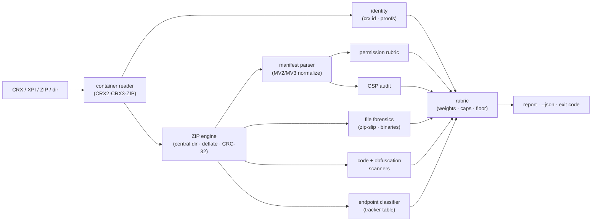

# crxray

[English](README.md) | [中文](README.zh.md) | [日本語](README.ja.md)

[](LICENSE)   [](CONTRIBUTING.md)

**依存ゼロの CLI。ブラウザ拡張を解体して監査する——権限・リモートコード読み込み・難読化・トラッカーエンドポイント——透明なリスク評価基準つきで、完全オフライン、CRX と XPI の両方に対応。**


```bash
# まだ npm 未公開——本リポジトリのチェックアウトからインストール
npm install && npm run build && npm pack
npm install -g ./crxray-0.1.0.tgz
```

## なぜ crxray？

ブラウザ拡張はあなたのセッション全体に手が届くコードであり、インストールする `.crx` は署名済み ZIP――その中身をストア審査が見たのは数か月前に一度だけで、アカウントが売られる前、更新サーバが差し替えられる前、依存が寝返る前のことだ。拡張のサプライチェーン攻撃が当たり続けるのは、すでに信頼しているパッケージの中身を誰も覗かないからだ。助けになりそうなツールはどれも一枚欠けている。手作業の解凍はファイルは見せてくれても、その*意味*は見せてくれない（どの権限がセッション級の cookie アクセスを与える？ どのホストパターンが「全サイト」を意味する？）。`web-ext lint` やストア検証器は公開者向けにポリシー適合を調べるもので、導入者向けのリスク評価ではない。汎用の秘密スキャナは鍵は見つけても `importScripts("https://…")` は見つけない。オンラインの CRX ビューアは、まさに疑っているその成果物をアップロードさせようとする。crxray は監査者の問いのために作られている――ネットワークなしで CRX2・CRX3・XPI（および解凍済みディレクトリ）を開き、コンテナ自身の身元主張を読み、各権限を最悪ケースの能力で採点し、ソースからリモートコード読み込み・難読化・プライバシーのベクトルを洗い出し、各エンドポイントをトラッカー表と照合して分類し、アーカイブの衛生を CRC-32 まで確認し――そのすべてを、あなたが反論できる成文の評価基準つきで一つの 0–100 スコアに畳み込む。

| | crxray | 手動解凍 + grep | `web-ext lint` / ストア検証器 | オンライン CRX ビューア |
|---|---|---|---|---|
| CRX2・CRX3 **と** XPI をオフラインで開く | ✅ | 🟡 XPI のみ（CRX はヘッダ除去が必要） | 🟡 XPI 向け | ✅ ただし要アップロード |
| 権限をポリシーでなく能力で採点 | ✅ 評価基準 | ❌ 解釈は自分で | ❌ 適合志向 | 🟡 一覧のみ |
| リモートコードを標記（`eval`・`importScripts`・リモート `<script>`・CSP） | ✅ | 🟡 パターンを知っていれば | ❌ | ❌ |
| 難読化を検出（エントロピー・十六進識別子・パッカー） | ✅ | ❌ | ❌ | ❌ |
| トラッカー / 生 IP / punycode エンドポイントを分類 | ✅ | ❌ | ❌ | ❌ |
| 単一の評価基準スコア + CI 終了コード | ✅ `--fail-on` | ❌ | 🟡 ポリシーで 合否 | ❌ |
| ネットワークゼロ・依存ゼロで動作 | ✅ | ✅ | ❌ npm 依存木 | ❌ 要アップロード |

<sub>各ツールの公開ドキュメントと挙動との対照、2026-07。crxray は静的なパッケージ内容を監査する。署名の検証も拡張の実行も行わない。</sub>

## 特徴

- **CRX2・CRX3・XPI と解凍済みディレクトリ** —— 一つのツールで Chrome の署名済みコンテナ（両世代）、Firefox の XPI（実体は普通の ZIP）、素の ZIP、ディスク上のディレクトリを読める。依存なしの読取器が中央ディレクトリを解析し、deflate を展開し、CRC-32 を検証するので、パッキング後に改竄された負荷は信頼されるのでなく暴かれる。
- **能力で採点する権限基準** —— すべての API とホスト権限は、拡張が侵害された場合に何を*可能にする*かで採点される（`debugger` と `<all_urls>` は critical、`cookies` は high、`storage` は info）。危害を段階的に高める組み合わせ――`cookies` + 広範ホスト、`webRequest` + ブロッキング + 広範ホスト――は明示的に名指しされる。
- **リモートコード・フォレンジック** —— パターンスキャナ（コメントを認識し、パーサ依存なし）が `eval`・`new Function`・文字列タイマー・リモート URL からの `importScripts`/動的 `import()`・`executeScript` のコード文字列・ページ内のリモート `<script src>`、そしてそれらを合法化する CSP の弱体化（`unsafe-eval`・ホワイトリスト化されたスクリプトオリジン）を捕える。
- **難読化検出** —— 文字列リテラルへのシャノンエントロピー、十六進識別子の密度（`_0x4f2a…`）、パッカー署名、エスケープ列の比率が、*ミニファイ*（正常、info 判定）と*難読化*（敵対的、high 判定）を切り分ける――難読化はまさにこの審査を阻むために存在するからだ。
- **エンドポイント分類** —— すべての `http(s)`/`ws(s)` リテラルを抽出・重複排除し、内蔵の解析・セッションリプレイ・広告・エラー追跡ネットワーク表に照合して分類する。加えてハードコードされた生 IP エンドポイント、punycode の同形異義、平文トランスポートも扱う。
- **透明な単一スコア、CI のために** —— 各所見は固定の重大度重みとカテゴリ別の上限を経て 0–100 のスコアとレベルに集約される。`--fail-on` が終了コードの門を定め、`--json` が結果全体を出力し、すべてが決定的で [docs/rubric.md](docs/rubric.md) に成文化されている。
- **実行時依存ゼロ、完全オフライン** —— 要件は Node.js のみ。crxray はソケットを開かず、`typescript` が唯一の devDependency だ。

## クイックスタート

同梱の悪性フィクスチャ（仕込まれた無害な赤旗で満載の CRX3）を監査する：

```bash
# チェックアウトのルートから実行
crxray scan examples/suspicious.crx
```

出力（実行を実際に捕捉、抜粋）：

```text
crxray 0.1.0 — static extension audit

package   examples/suspicious.crx · crx3 · 4 files · 1.7 KiB
sha256    fa006f69356cc06e880cb627ee0de54690226c8b18541eaab065149e9041353a
identity  Coupon Helper Pro · v4.2.1 · MV2 · id ponmlkjihgfedcbaabcdefghijklmnop
risk      100/100 · CRITICAL
breakdown permissions 45 · csp 30 · remote-code 45 · identity 12 · obfuscation 12 · network 22 · privacy 17

findings (20)
  SEVERITY  RULE                      LOCATION          FINDING
  critical  PERM_COMBO_COOKIES        manifest.json     combination: cookies + broad hosts
  critical  PERM_COMBO_INTERCEPT      manifest.json     combination: webRequest + webRequestBlocking + broad hosts
  critical  PERM_HOST                 manifest.json     permission: <all_urls>
  critical  CSP_REMOTE_SCRIPT_SRC     manifest.json     CSP whitelists remote scripts from https://cdn.coupon-helpe…
  critical  RCL_IMPORTSCRIPTS_REMOTE  background.js:14  importScripts() from a remote URL
  critical  RCL_REMOTE_SCRIPT_TAG     popup.html:6      remote <script src> in an extension page
  high      ID_SELF_HOSTED_UPDATE     manifest.json     self-hosted update server: updates.coupon-helper.example
  high      PERM_API                  manifest.json     permission: cookies
  high      PERM_API                  manifest.json     permission: webRequestBlocking
  high      PERM_CONTENT_SCRIPT_ALL   manifest.json     content script injected into every website
  high      RCL_EVAL                  inject.js:11      eval() call
  high      OBF_OBFUSCATED            inject.js         obfuscated JavaScript
  high      NET_RAW_IP                background.js     hardcoded IP endpoint: 198.51.100.42
  high      PRIV_KEY_LISTENER         inject.js:2       keystroke listener in a content script
  medium    PERM_API                  manifest.json     permission: tabs
  medium    PERM_API                  manifest.json     permission: webRequest
  medium    PERM_API                  manifest.json     optional permission: history
  medium    NET_PUNYCODE_HOST         inject.js         punycode hostname: xn--login-3e8b.coupon-helper.example
  medium    NET_TRACKER               background.js     analytics endpoint: www.google-analytics.com
  medium    PRIV_COOKIES_GETALL       background.js:16  bulk cookie read (cookies.getAll)
  … (the permission and endpoint tables follow — trimmed)
```

終了コードは `1`：リスクレベル（`critical`）が既定の `--fail-on high` の門を満たすか超えているので、pre-commit フックやパイプラインがインストールを止められる。クリーンな拡張は曖昧さがない――`crxray scan examples/clean-notes`（実行を実際に捕捉、完全な出力）：

```text
crxray 0.1.0 — static extension audit

package   examples/clean-notes · directory · 5 files
identity  Quick Notes · v1.3.0 · MV3
risk      0/100 · MINIMAL

findings (0)
  none — nothing in the rubric fired

permissions (1)
  GRADE  KIND  PERMISSION  WHY IT MATTERS
  info   api   storage     extension-local key-value storage
```

さらなるシナリオ――`manifest`・`urls`・`id`・安全な `unpack`――は [examples/](examples/README.md) にある。

## コマンド

| コマンド | 役割 | 主なオプション |
|---|---|---|
| `scan <file\|dir>` | 完全な監査、評価基準で採点（既定コマンド） | `--json`・`--fail-on <level>` |
| `unpack <file>` | 負荷を安全に取り出す（zip-slip エントリは拒否） | `-o`・`--force` |
| `manifest <file\|dir>` | 正規化されたマニフェスト事実と採点済み権限 | `--json` |
| `urls <file\|dir>` | パッケージ内のすべてのエンドポイント・リテラル、分類済み | `--json` |
| `id <file\|dir>` | 身元の証拠：crx id・gecko id・sha256・署名 | `--json` |

素の `crxray <file>` は `scan` を実行する。終了コードはスクリプトに優しい：`0` 正常、`1` リスクが `--fail-on`（既定 `high`）以上、または `unpack` が安全でないエントリを拒否、`2` 用法または入力エラー。

## 所見カテゴリ

| カテゴリ | 規則が扱うもの | 例 |
|---|---|---|
| `identity` | マニフェストの有無、自ホスト更新、key/id 不一致 | `ID_SELF_HOSTED_UPDATE` |
| `permissions` | API + ホスト採点と危害を高める組み合わせ | `PERM_COMBO_COOKIES` |
| `csp` | eval の有効化、リモートスクリプトのオリジン | `CSP_REMOTE_SCRIPT_SRC` |
| `remote-code` | eval・`importScripts`・動的 import・リモート `<script>` | `RCL_IMPORTSCRIPTS_REMOTE` |
| `obfuscation` | エントロピー・十六進識別子・パッカー・不透明な負荷 | `OBF_OBFUSCATED` |
| `network` | トラッカー・生 IP・punycode・平文トランスポート | `NET_RAW_IP` |
| `privacy` | 打鍵の捕捉・クリップボード・cookie の一括読み取り | `PRIV_KEY_LISTENER` |
| `files` | zip-slip・重複・CRC の虚偽・ネイティブバイナリ | `FILE_NATIVE_BINARY` |

各所見の重大度は固定の重みを与える。各カテゴリには上限があるので、ある軸での量が別の軸の本物の穴を押し流すことはない。採点の完全な契約――重み・上限・区分・最悪所見の下限――は [docs/rubric.md](docs/rubric.md) にある。

## アーキテクチャ



## ロードマップ

- [x] CRX2/CRX3/XPI/ZIP/ディレクトリ 読取器、権限評価基準、CSP + リモートコード + 難読化 + エンドポイント スキャナ、アーカイブ衛生、JSON 出力、安全な解凍、90 テスト + スモークスクリプト（v0.1.0）
- [ ] 署名の*検証*（RSA/ECDSA 証明）をオプトインのフラグの背後に
- [ ] 差分モード：拡張の二つのバージョンを比較して差分を採点
- [ ] 設定可能なルールファイル（カスタムエンドポイント、権限の上書き、許可リスト）
- [ ] 標記された束向けの、source-map を認識した反ミニファイのヒント
- [ ] コードスキャンのダッシュボード向け SARIF 出力
- [ ] npm への公開

完全な一覧は [open issues](https://github.com/JaydenCJ/crxray/issues) を参照。

## コントリビュート

貢献を歓迎する。`npm install && npm run build` でビルドし、`npm test` と `bash scripts/smoke.sh`（`SMOKE OK` を印字する必要がある）を実行する――本リポジトリは CI を同梱せず、上記の各主張はローカル実行で検証される。[CONTRIBUTING.md](CONTRIBUTING.md) を参照し、[good first issue](https://github.com/JaydenCJ/crxray/issues?q=is%3Aissue+is%3Aopen+label%3A%22good+first+issue%22) を拾い、または [discussion](https://github.com/JaydenCJ/crxray/discussions) を始めてほしい。

## ライセンス

[MIT](LICENSE)
