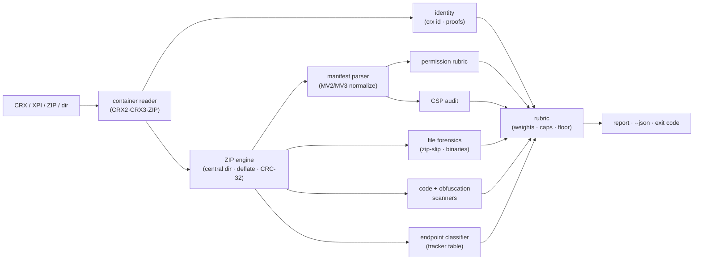

# crxray

[English](README.md) | [中文](README.zh.md) | [日本語](README.ja.md)

[](LICENSE)   [](CONTRIBUTING.md)

**A zero-dependency CLI that unpacks and audits browser extensions — permissions, remote code loading, obfuscation and tracker endpoints — with a transparent risk rubric, fully offline, for CRX and XPI both.**


```bash
# not yet on npm — install from a checkout of this repository
npm install && npm run build && npm pack
npm install -g ./crxray-0.1.0.tgz
```

## Why crxray?

A browser extension is code with your whole session inside its reach, and the `.crx` you install is a signed ZIP whose contents store review saw once, months ago — before the account got sold, the update server got repointed, or a dependency turned. Extension supply-chain attacks keep landing because nobody looks inside the package they already trust. The tools that could help each miss a piece: unzipping by hand shows you files but not what they *mean* (which permission grants session-cadence cookie access? which host pattern means "every site"?), `web-ext lint` and store validators check policy compliance for publishers, not risk for installers, generic secret scanners find keys but not `importScripts("https://…")`, and the online CRX viewers want you to upload the very artifact you are suspicious of. crxray is built for the auditor's question: it opens CRX2, CRX3 and XPI (and unpacked directories) without a network, reads the container's own identity claims, grades every permission by worst-case capability, greps the sources for remote-code-loading and obfuscation and privacy vectors, classifies every endpoint against a tracker table, checks archive hygiene down to CRC-32 — and folds all of it into one 0–100 score with a documented rubric you can argue with.

| | crxray | manual unzip + grep | `web-ext lint` / store validators | online CRX viewers |
|---|---|---|---|---|
| Opens CRX2, CRX3 **and** XPI offline | ✅ | 🟡 XPI only (CRX needs stripping) | 🟡 XPI-oriented | ✅ but you upload it |
| Grades permissions by capability, not policy | ✅ rubric | ❌ you interpret | ❌ compliance-oriented | 🟡 lists only |
| Flags remote code (`eval`, `importScripts`, remote `<script>`, CSP) | ✅ | 🟡 if you know the patterns | ❌ | ❌ |
| Detects obfuscation (entropy, hex ids, packers) | ✅ | ❌ | ❌ | ❌ |
| Classifies tracker / raw-IP / punycode endpoints | ✅ | ❌ | ❌ | ❌ |
| One rubric score + CI exit code | ✅ `--fail-on` | ❌ | 🟡 pass/fail on policy | ❌ |
| Runs with zero network, zero dependencies | ✅ | ✅ | ❌ npm tree | ❌ upload |

<sub>Comparison against each tool's public docs and behavior, 2026-07. crxray audits static package contents; it does not verify signatures or run the extension.</sub>

## Features

- **CRX2, CRX3, XPI and unpacked directories** — one tool reads Chrome's signed container (both generations), Firefox's XPI (a plain ZIP), a bare ZIP, or a directory on disk; the dependency-free reader parses the central directory, decompresses deflate, and verifies CRC-32 so a payload tampered after packing is surfaced, not trusted.
- **A permission rubric that grades capability** — every API and host permission is scored by what it *enables* if the extension is compromised (`debugger` and `<all_urls>` critical, `cookies` high, `storage` info), with the combinations that escalate — `cookies` + broad hosts, `webRequest` + blocking + broad hosts — called out explicitly.
- **Remote-code forensics** — pattern scanners (comment-aware, no parser dependency) catch `eval`, `new Function`, string timers, `importScripts`/dynamic `import()` from remote URLs, `executeScript` code strings, remote `<script src>` in pages, and the CSP weakenings (`unsafe-eval`, whitelisted script origins) that legalize them.
- **Obfuscation detection** — Shannon entropy over string literals, hex-identifier density (`_0x4f2a…`), packer signatures and escape-sequence ratios separate *minified* (normal, graded info) from *obfuscated* (adversarial, graded high) — because obfuscation exists to defeat exactly this review.
- **Endpoint classification** — every `http(s)`/`ws(s)` literal is extracted, deduplicated and classified against a built-in table of analytics, session-replay, ad and error-tracking networks, plus hardcoded raw-IP endpoints, punycode homographs and plaintext transports.
- **One transparent score, built for CI** — findings roll up through fixed severity weights and per-category caps into a 0–100 score and a level; `--fail-on` sets the exit-code gate, `--json` emits the whole result, and everything is deterministic and documented in [docs/rubric.md](docs/rubric.md).
- **Zero runtime dependencies, fully offline** — Node.js is the only requirement; crxray never opens a socket, and `typescript` is the sole devDependency.

## Quickstart

Audit the bundled hostile fixture (a CRX3 packed full of planted, inert red flags):

```bash
# from the root of your checkout
crxray scan examples/suspicious.crx
```

Output (real captured run, trimmed):

```text
crxray 0.1.0 — static extension audit

package   examples/suspicious.crx · crx3 · 4 files · 1.7 KiB
sha256    fa006f69356cc06e880cb627ee0de54690226c8b18541eaab065149e9041353a
identity  Coupon Helper Pro · v4.2.1 · MV2 · id ponmlkjihgfedcbaabcdefghijklmnop
risk      100/100 · CRITICAL
breakdown permissions 45 · csp 30 · remote-code 45 · identity 12 · obfuscation 12 · network 22 · privacy 17

findings (20)
  SEVERITY  RULE                      LOCATION          FINDING
  critical  PERM_COMBO_COOKIES        manifest.json     combination: cookies + broad hosts
  critical  PERM_COMBO_INTERCEPT      manifest.json     combination: webRequest + webRequestBlocking + broad hosts
  critical  PERM_HOST                 manifest.json     permission: <all_urls>
  critical  CSP_REMOTE_SCRIPT_SRC     manifest.json     CSP whitelists remote scripts from https://cdn.coupon-helpe…
  critical  RCL_IMPORTSCRIPTS_REMOTE  background.js:14  importScripts() from a remote URL
  critical  RCL_REMOTE_SCRIPT_TAG     popup.html:6      remote <script src> in an extension page
  high      ID_SELF_HOSTED_UPDATE     manifest.json     self-hosted update server: updates.coupon-helper.example
  high      PERM_API                  manifest.json     permission: cookies
  high      PERM_API                  manifest.json     permission: webRequestBlocking
  high      PERM_CONTENT_SCRIPT_ALL   manifest.json     content script injected into every website
  high      RCL_EVAL                  inject.js:11      eval() call
  high      OBF_OBFUSCATED            inject.js         obfuscated JavaScript
  high      NET_RAW_IP                background.js     hardcoded IP endpoint: 198.51.100.42
  high      PRIV_KEY_LISTENER         inject.js:2       keystroke listener in a content script
  medium    PERM_API                  manifest.json     permission: tabs
  medium    PERM_API                  manifest.json     permission: webRequest
  medium    PERM_API                  manifest.json     optional permission: history
  medium    NET_PUNYCODE_HOST         inject.js         punycode hostname: xn--login-3e8b.coupon-helper.example
  medium    NET_TRACKER               background.js     analytics endpoint: www.google-analytics.com
  medium    PRIV_COOKIES_GETALL       background.js:16  bulk cookie read (cookies.getAll)
  … (the permission and endpoint tables follow — trimmed)
```

The exit code is `1`: the risk level (`critical`) is at or above the default `--fail-on high` gate, so a pre-commit hook or pipeline can block the install. A clean extension is unambiguous — `crxray scan examples/clean-notes` (real captured run, complete):

```text
crxray 0.1.0 — static extension audit

package   examples/clean-notes · directory · 5 files
identity  Quick Notes · v1.3.0 · MV3
risk      0/100 · MINIMAL

findings (0)
  none — nothing in the rubric fired

permissions (1)
  GRADE  KIND  PERMISSION  WHY IT MATTERS
  info   api   storage     extension-local key-value storage
```

More scenarios — `manifest`, `urls`, `id`, safe `unpack` — live in [examples/](examples/README.md).

## Commands

| Command | Does | Key options |
|---|---|---|
| `scan <file\|dir>` | full audit, scored by the rubric (the default command) | `--json`, `--fail-on <level>` |
| `unpack <file>` | extract the payload safely (zip-slip entries refused) | `-o`, `--force` |
| `manifest <file\|dir>` | normalized manifest facts and graded permissions | `--json` |
| `urls <file\|dir>` | every endpoint literal in the package, classified | `--json` |
| `id <file\|dir>` | identity evidence: crx id, gecko id, sha256, signatures | `--json` |

A bare `crxray <file>` runs `scan`. Exit codes are script-friendly: `0` ok, `1` risk at/above `--fail-on` (default `high`) or unsafe entries refused by `unpack`, `2` usage or input error.

## Finding categories

| Category | Rules cover | Example |
|---|---|---|
| `identity` | manifest presence, self-hosted updates, key/id mismatch | `ID_SELF_HOSTED_UPDATE` |
| `permissions` | API + host grades and escalating combinations | `PERM_COMBO_COOKIES` |
| `csp` | eval enablement, remote script origins | `CSP_REMOTE_SCRIPT_SRC` |
| `remote-code` | eval, `importScripts`, dynamic import, remote `<script>` | `RCL_IMPORTSCRIPTS_REMOTE` |
| `obfuscation` | entropy, hex ids, packers, opaque payloads | `OBF_OBFUSCATED` |
| `network` | trackers, raw IPs, punycode, plaintext transports | `NET_RAW_IP` |
| `privacy` | keystroke capture, clipboard, bulk cookie reads | `PRIV_KEY_LISTENER` |
| `files` | zip-slip, duplicates, CRC lies, native binaries | `FILE_NATIVE_BINARY` |

Each finding's severity contributes a fixed weight; each category is capped so quantity in one axis cannot drown a real hole in another. The full scoring contract — weights, caps, buckets, the worst-finding floor — is in [docs/rubric.md](docs/rubric.md).

## Architecture



## Roadmap

- [x] CRX2/CRX3/XPI/ZIP/dir reader, permission rubric, CSP + remote-code + obfuscation + endpoint scanners, archive hygiene, JSON output, safe unpack, 90 tests + smoke script (v0.1.0)
- [ ] Signature *verification* (RSA/ECDSA proofs) behind an opt-in flag
- [ ] Diff mode: compare two versions of an extension and grade the delta
- [ ] Configurable rules file (custom endpoints, permission overrides, allowlists)
- [ ] Source-map–aware unminification hints for flagged bundles
- [ ] SARIF output for code-scanning dashboards
- [ ] Publish to npm

See the [open issues](https://github.com/JaydenCJ/crxray/issues) for the full list.

## Contributing

Contributions are welcome. Build with `npm install && npm run build`, then run `npm test` and `bash scripts/smoke.sh` (must print `SMOKE OK`) — this repository ships no CI, every claim above is verified by local runs. See [CONTRIBUTING.md](CONTRIBUTING.md), grab a [good first issue](https://github.com/JaydenCJ/crxray/issues?q=is%3Aissue+is%3Aopen+label%3A%22good+first+issue%22), or start a [discussion](https://github.com/JaydenCJ/crxray/discussions).

## License

[MIT](LICENSE)
