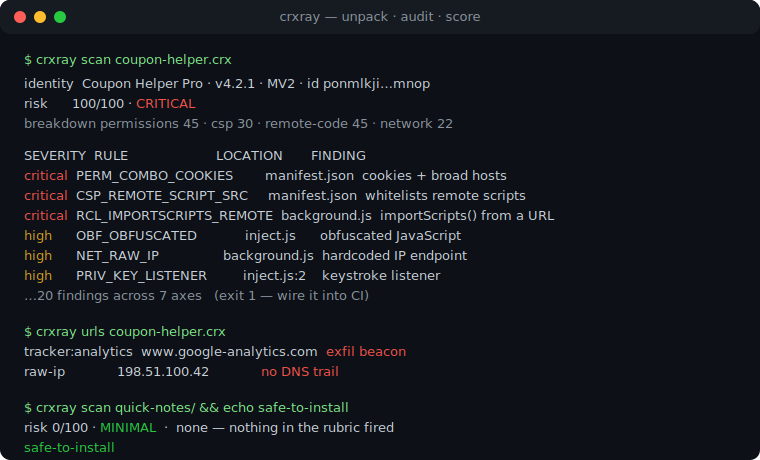
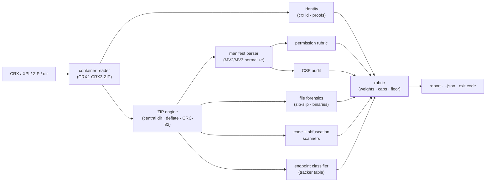

# crxray

[English](README.md) | [中文](README.zh.md) | [日本語](README.ja.md)

[](LICENSE)   [](CONTRIBUTING.md)

**零依赖 CLI，解包并审计浏览器扩展——权限、远程代码加载、混淆与追踪端点——配有透明的风险评分标准，完全离线，同时支持 CRX 与 XPI。**



```bash
# 尚未发布到 npm——请从本仓库的检出目录安装
npm install && npm run build && npm pack
npm install -g ./crxray-0.1.0.tgz
```

## 为什么选择 crxray？

浏览器扩展是能触及你整个会话的代码，而你安装的 `.crx` 是一个已签名的 ZIP，其内容商店审核只在几个月前看过一次——那时账号还没被卖掉、更新服务器还没被改指向、依赖也还没变质。扩展供应链攻击之所以屡屡得手，就是因为没人会去查看那个自己早已信任的包。能帮上忙的工具各自都缺了一块：手动解压给你看到文件却看不出它们的*含义*（哪个权限授予了会话级别的 cookie 访问？哪个主机模式意味着「所有站点」？）；`web-ext lint` 和商店校验器为发布者检查政策合规，而非为安装者评估风险；通用的密钥扫描器能找到密钥却找不到 `importScripts("https://…")`；而在线 CRX 查看器又要你上传那个你本就怀疑的文件。crxray 是为审计者的提问而生：它无需联网即可打开 CRX2、CRX3 与 XPI（以及已解包的目录），读取容器自身的身份声明，按最坏情况的能力为每个权限评级，在源码里搜出远程代码加载、混淆与隐私向量，对照追踪端点表分类每个端点，把归档卫生一路检查到 CRC-32——并将这一切汇成一个 0–100 的分数，配上一份你可以据理力争的成文评分标准。

| | crxray | 手动解压 + grep | `web-ext lint` / 商店校验器 | 在线 CRX 查看器 |
|---|---|---|---|---|
| 离线打开 CRX2、CRX3 **和** XPI | ✅ | 🟡 仅 XPI（CRX 需剥离头部） | 🟡 面向 XPI | ✅ 但需上传 |
| 按能力而非政策为权限评级 | ✅ 评分标准 | ❌ 需你自行解读 | ❌ 面向合规 | 🟡 仅列出 |
| 标记远程代码（`eval`、`importScripts`、远程 `<script>`、CSP） | ✅ | 🟡 若你熟悉这些模式 | ❌ | ❌ |
| 检测混淆（熵、十六进制标识符、打包器） | ✅ | ❌ | ❌ | ❌ |
| 分类追踪 / 裸 IP / punycode 端点 | ✅ | ❌ | ❌ | ❌ |
| 单一评分标准分数 + CI 退出码 | ✅ `--fail-on` | ❌ | 🟡 按政策 通过/失败 | ❌ |
| 零网络、零依赖运行 | ✅ | ✅ | ❌ npm 依赖树 | ❌ 需上传 |

<sub>对照各工具公开文档与行为，2026-07。crxray 审计静态包内容；它不验证签名，也不运行扩展。</sub>

## 特性

- **CRX2、CRX3、XPI 与已解包目录** —— 一个工具即可读取 Chrome 的已签名容器（两代皆可）、Firefox 的 XPI（本质是普通 ZIP）、裸 ZIP，或磁盘上的目录；无依赖的读取器解析中央目录、解压 deflate 并校验 CRC-32，因此打包后被篡改的负载会被暴露，而非被信任。
- **一套按能力评级的权限标准** —— 每个 API 与主机权限都按扩展一旦被攻陷时它*能做什么*来评分（`debugger` 与 `<all_urls>` 为 critical，`cookies` 为 high，`storage` 为 info），并显式点名那些会升级危害的组合——`cookies` + 宽泛主机、`webRequest` + 阻断 + 宽泛主机。
- **远程代码取证** —— 模式扫描器（识别注释、无需解析器依赖）能捕获 `eval`、`new Function`、字符串定时器、来自远程 URL 的 `importScripts`/动态 `import()`、`executeScript` 代码字符串、页面里的远程 `<script src>`，以及使它们合法化的 CSP 弱化（`unsafe-eval`、白名单脚本来源）。
- **混淆检测** —— 对字符串字面量做香农熵计算、十六进制标识符密度（`_0x4f2a…`）、打包器特征与转义序列比例，把*压缩*（正常，评为 info）与*混淆*（对抗性，评为 high）区分开——因为混淆的存在正是为了挫败这种审查。
- **端点分类** —— 每个 `http(s)`/`ws(s)` 字面量都会被提取、去重，并对照内置的分析、会话回放、广告与错误追踪网络表加以分类，此外还包括硬编码的裸 IP 端点、punycode 同形异义域与明文传输。
- **单一透明分数，为 CI 而生** —— 各项发现经固定的严重度权重与各类别上限，汇成 0–100 分数与一个等级；`--fail-on` 设定退出码闸门，`--json` 输出完整结果，一切都是确定性的，并成文于 [docs/rubric.md](docs/rubric.md)。
- **零运行时依赖，完全离线** —— 唯一的要求是 Node.js；crxray 从不打开套接字，而 `typescript` 是唯一的 devDependency。

## 快速上手

审计随附的恶意样本（一个塞满预设、无害红旗的 CRX3）：

```bash
# 在检出目录的根部执行
crxray scan examples/suspicious.crx
```

输出（真实运行捕获，已裁剪）：

```text
crxray 0.1.0 — static extension audit

package   examples/suspicious.crx · crx3 · 4 files · 1.7 KiB
sha256    fa006f69356cc06e880cb627ee0de54690226c8b18541eaab065149e9041353a
identity  Coupon Helper Pro · v4.2.1 · MV2 · id ponmlkjihgfedcbaabcdefghijklmnop
risk      100/100 · CRITICAL
breakdown permissions 45 · csp 30 · remote-code 45 · identity 12 · obfuscation 12 · network 22 · privacy 17

findings (20)
  SEVERITY  RULE                      LOCATION          FINDING
  critical  PERM_COMBO_COOKIES        manifest.json     combination: cookies + broad hosts
  critical  PERM_COMBO_INTERCEPT      manifest.json     combination: webRequest + webRequestBlocking + broad hosts
  critical  PERM_HOST                 manifest.json     permission: <all_urls>
  critical  CSP_REMOTE_SCRIPT_SRC     manifest.json     CSP whitelists remote scripts from https://cdn.coupon-helpe…
  critical  RCL_IMPORTSCRIPTS_REMOTE  background.js:14  importScripts() from a remote URL
  critical  RCL_REMOTE_SCRIPT_TAG     popup.html:6      remote <script src> in an extension page
  high      ID_SELF_HOSTED_UPDATE     manifest.json     self-hosted update server: updates.coupon-helper.example
  high      PERM_API                  manifest.json     permission: cookies
  high      PERM_API                  manifest.json     permission: webRequestBlocking
  high      PERM_CONTENT_SCRIPT_ALL   manifest.json     content script injected into every website
  high      RCL_EVAL                  inject.js:11      eval() call
  high      OBF_OBFUSCATED            inject.js         obfuscated JavaScript
  high      NET_RAW_IP                background.js     hardcoded IP endpoint: 198.51.100.42
  high      PRIV_KEY_LISTENER         inject.js:2       keystroke listener in a content script
  medium    PERM_API                  manifest.json     permission: tabs
  medium    PERM_API                  manifest.json     permission: webRequest
  medium    PERM_API                  manifest.json     optional permission: history
  medium    NET_PUNYCODE_HOST         inject.js         punycode hostname: xn--login-3e8b.coupon-helper.example
  medium    NET_TRACKER               background.js     analytics endpoint: www.google-analytics.com
  medium    PRIV_COOKIES_GETALL       background.js:16  bulk cookie read (cookies.getAll)
  … (the permission and endpoint tables follow — trimmed)
```

退出码为 `1`：风险等级（`critical`）达到或超过默认的 `--fail-on high` 闸门，因此预提交钩子或流水线可以拦下此次安装。干净的扩展则毫不含糊——`crxray scan examples/clean-notes`（真实运行捕获，完整输出）：

```text
crxray 0.1.0 — static extension audit

package   examples/clean-notes · directory · 5 files
identity  Quick Notes · v1.3.0 · MV3
risk      0/100 · MINIMAL

findings (0)
  none — nothing in the rubric fired

permissions (1)
  GRADE  KIND  PERMISSION  WHY IT MATTERS
  info   api   storage     extension-local key-value storage
```

更多场景——`manifest`、`urls`、`id`、安全的 `unpack`——见 [examples/](examples/README.md)。

## 命令

| 命令 | 作用 | 主要选项 |
|---|---|---|
| `scan <file\|dir>` | 完整审计，按评分标准打分（默认命令） | `--json`、`--fail-on <level>` |
| `unpack <file>` | 安全地解出负载（拒绝 zip-slip 条目） | `-o`、`--force` |
| `manifest <file\|dir>` | 规范化的清单事实与已评级权限 | `--json` |
| `urls <file\|dir>` | 包中每个端点字面量，已分类 | `--json` |
| `id <file\|dir>` | 身份证据：crx id、gecko id、sha256、签名 | `--json` |

裸写 `crxray <file>` 即运行 `scan`。退出码对脚本友好：`0` 正常，`1` 风险达到/超过 `--fail-on`（默认 `high`）或 `unpack` 拒绝了不安全条目，`2` 用法或输入错误。

## 发现类别

| 类别 | 规则覆盖 | 示例 |
|---|---|---|
| `identity` | 清单是否存在、自托管更新、key/id 不匹配 | `ID_SELF_HOSTED_UPDATE` |
| `permissions` | API + 主机评级与升级危害的组合 | `PERM_COMBO_COOKIES` |
| `csp` | 启用 eval、远程脚本来源 | `CSP_REMOTE_SCRIPT_SRC` |
| `remote-code` | eval、`importScripts`、动态 import、远程 `<script>` | `RCL_IMPORTSCRIPTS_REMOTE` |
| `obfuscation` | 熵、十六进制标识符、打包器、不透明负载 | `OBF_OBFUSCATED` |
| `network` | 追踪器、裸 IP、punycode、明文传输 | `NET_RAW_IP` |
| `privacy` | 击键捕获、剪贴板、批量读取 cookie | `PRIV_KEY_LISTENER` |
| `files` | zip-slip、重复项、CRC 谎报、原生二进制 | `FILE_NATIVE_BINARY` |

每项发现的严重度贡献一份固定权重；每个类别都有上限，因此某一轴上的数量不会淹没另一轴上的真实漏洞。完整的打分契约——权重、上限、分档、最严发现下限——见 [docs/rubric.md](docs/rubric.md)。

## 架构



## 路线图

- [x] CRX2/CRX3/XPI/ZIP/目录 读取器、权限评分标准、CSP + 远程代码 + 混淆 + 端点扫描器、归档卫生、JSON 输出、安全解包、90 项测试 + 冒烟脚本（v0.1.0）
- [ ] 签名*验证*（RSA/ECDSA 证明），置于一个可选开关之后
- [ ] 差异模式：比较扩展的两个版本并为增量评级
- [ ] 可配置规则文件（自定义端点、权限覆盖、白名单）
- [ ] 面向被标记捆绑包的、感知 source-map 的反压缩提示
- [ ] 面向代码扫描面板的 SARIF 输出
- [ ] 发布到 npm

完整清单见 [open issues](https://github.com/JaydenCJ/crxray/issues)。

## 贡献

欢迎贡献。用 `npm install && npm run build` 构建，然后运行 `npm test` 与 `bash scripts/smoke.sh`（必须打印 `SMOKE OK`）——本仓库不附带 CI，上面的每一条主张都由本地运行验证。参见 [CONTRIBUTING.md](CONTRIBUTING.md)，认领一个 [good first issue](https://github.com/JaydenCJ/crxray/issues?q=is%3Aissue+is%3Aopen+label%3A%22good+first+issue%22)，或发起一场 [discussion](https://github.com/JaydenCJ/crxray/discussions)。

## 许可证

[MIT](LICENSE)
